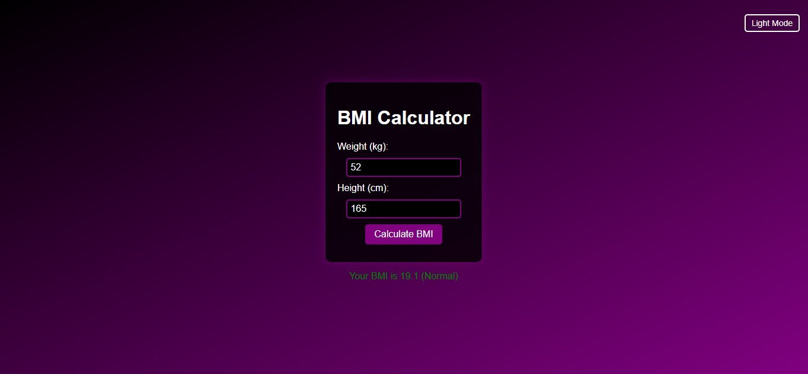
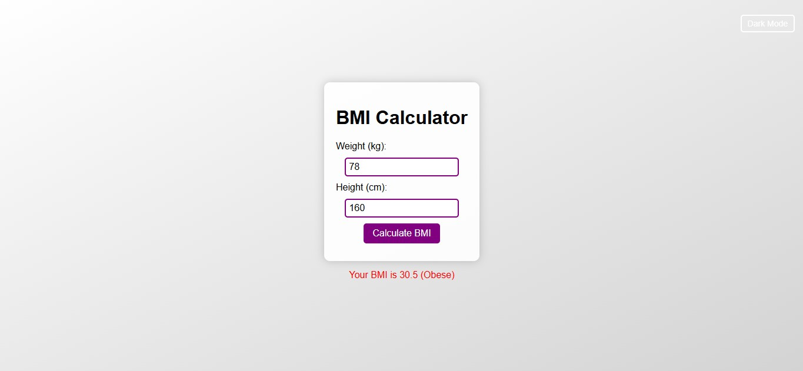

# BMI Calculator

A simple **BMI (Body Mass Index) Calculator** built using **HTML, CSS, and JavaScript**.

## Features
- Takes weight (kg) and height (cm) as input  
- Calculates BMI value  
- Displays BMI category (Underweight, Normal, Overweight, Obese)  
- Supports **Dark/Light Mode Toggle** for better user experience  

## How to Use
1. Open `bmi.html` in your browser.  
2. Enter your weight and height.  
3. Click **Calculate BMI** to see your BMI and health category.  
4. Use the toggle button to switch between dark and light mode.  

---

## Preview
### Dark Mode

### Light Mode

---